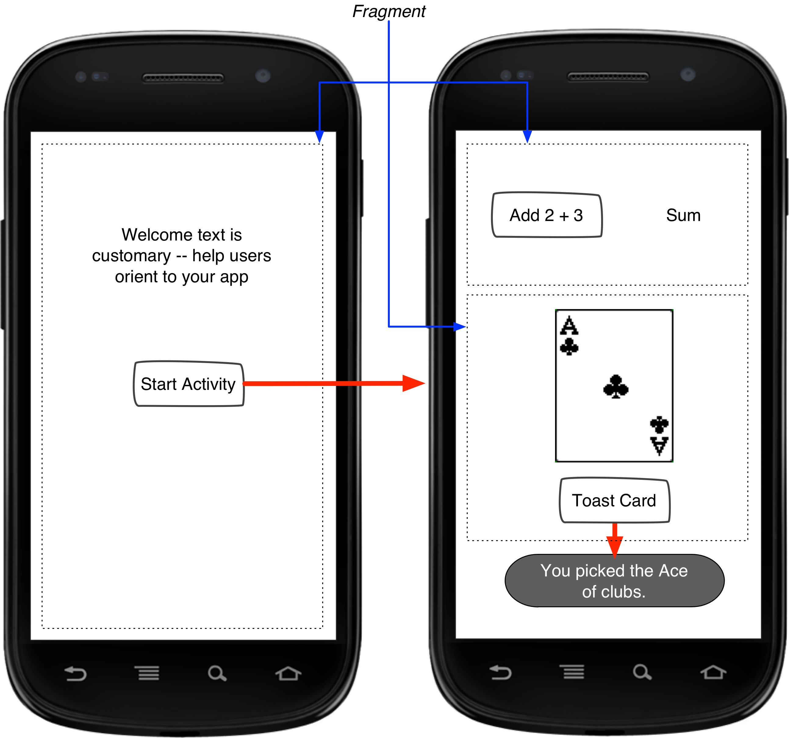

# Simple *Kata* 1

Let's start our first *kata*!

> Note: You can reference this exercise repeatedly while practicing TDD with Robolectric.

# Exercise

We will be implementing two different activities.

The `WelcomeActivity` will have a `WelcomeFragment` with text and a button that starts a new activity.

The `SecondActivity` has two fragments. The `SumFragment` has a button and a label. The button updates the label with the sum. The `CardFragment` has an image and a button. The button shows a toast.

# Tests

We will create this application using test driven development (TDD). After we write a test, we'll write the code to passes that test before moving on to add more functionality.

> Note: Before we start - make sure your tests run! We will be running the test regularly throughout this exercise must work off a known good state.

I've listed the tests that we'll work through to make this app a reality.

## Welcome Activity

* Test 1: Should not be null
* Test 2: Should have welcome fragment

## Welcome Fragment

* Test 3: Should not be null
* Test 4: Should have welcome text (configured properly)
* Test 5: Should have button (configured properly)
* Test 6: Button click should start a new activity

## Second Activity

* Test 7: Should not be null
* Test 8: Should have sum fragment
* Test 9: Should have card fragment

## Sum Fragment

* Test 10: Should not be null
* Test 11: Should have add button (configured properly)
* Test 12: Should have sum display (with default text)
* Test 13: After click of the add button, display 5 instead of "Sum"

## Card Fragment

* Test 14: Should not be null
* Test 15: Should have image (configured properly)
* Test 16: Should have toast card button (configured properly)
* Test 17: Should toast when clicked

# Resources

Check out my book that walks you through creating a calculator from start to finish using test driven development (TDD): [Android Activity Book](https://gumroad.com/l/androidactivitybook). Join [my newsletter](http://coreylatislaw.com/android-activity-book/) for updates about my books.
