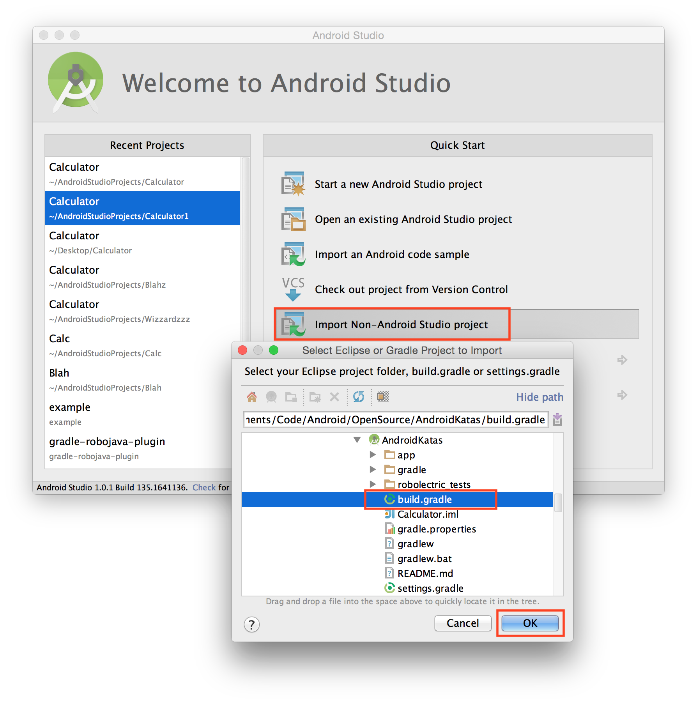
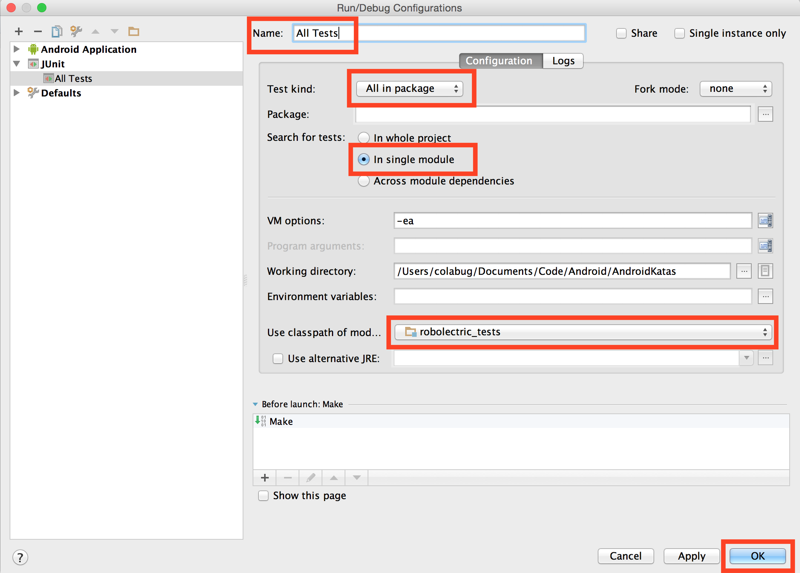
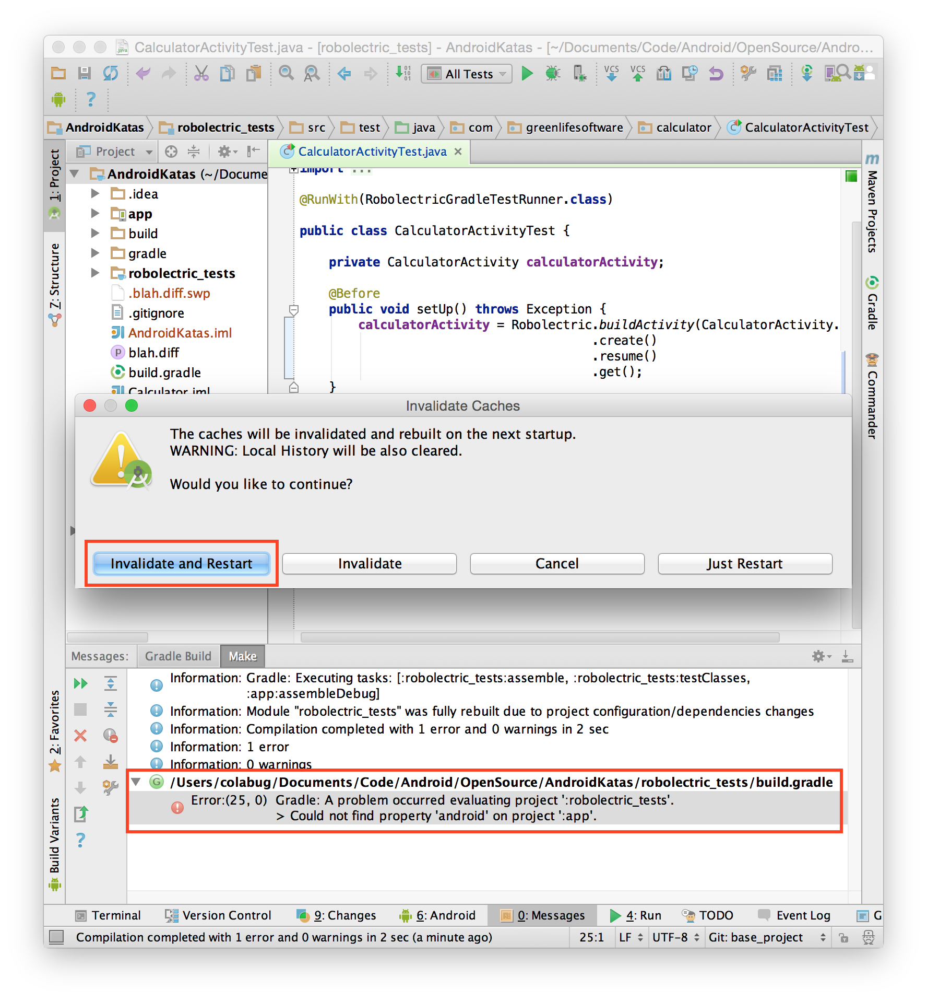

# Robolectric *Katas*

Use this repository a starting point to complete Android code *katas*.

## Import

The `master` branch has Robolectric preintegrated. Simply import into Android Studio using the "Import Non-Android Studio project" option and selecting the top-level `build.gradle` file. 



> Note: To become comfortable with integrating Robolectric, you can use the ["Hello, Robolectric" chapter of the Android Activity Book](https://gumroad.com/l/androidactivitybook) or my Pocket Guide to TDD with Robolectric (coming soon!) as a separate *kata*.

## Run the Tests

Now that the project is imported, ensure the tests run.

Create a [run configuration](http://blog.blundell-apps.com/how-to-run-robolectric-junit-tests-in-android-studio/) to run the tests from the IDE (my preferred method). To run the tests from the command line, use `./gradlew check`.



When running for the first time, I often get this error -- and sometimes well after the project has begun.

```
Error:(25,0) Gradle: A problem occured evaluating projecy ':robolectric_tests'.
             > Could not find property 'android' on project ':app'.
```

If you invalidate your caches and restart ("File" -> "Invalidate Caches / Restart ..."), it clears up the problem. Sometimes opening and closing Android Studio is required.



## *Katas*

Now that the project is configured, you're ready to work though some *katas*.

Join [my newsletter](http://coreylatislaw.com/android-activity-book/) for updates about my upcoming book with Android *katas*. In the meantime, check out these resources to help you on your test driven development (TDD) journey.
