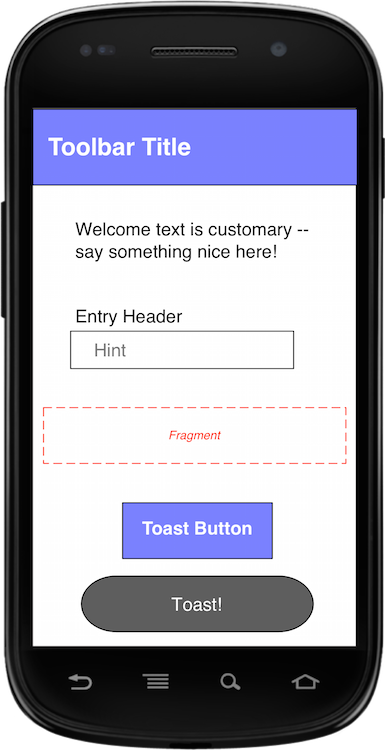

# *Kata*: Activity

This repository accompanies the [CasterIO video series](https://caster.io/episodes/integrating-robolectric-3-with-android-studio-2/) on testing with Robolectric. 

# Design

I've created a simple appication so that you can practice TDD.

# Exercise

We will be implementing one activity with several view types.

The `RobolectricPracticeActivity` will have several views.

* `Toolbar` with title text
* `TextView` with welcome text
* `TextView` header for data entry
* `EditText` with a hint for data entry
* `Fragment` with nothing in it (we'll test fragments in a future video)
* `Button` that toasts a message

# Tests

We will create this application using test driven development (TDD). After we write a test, we'll write the code to passes that test before moving on to add more functionality.

> Note: Before we start - make sure your tests run! We will be running the test regularly throughout this exercise must work off a known good state.

## Welcome Activity

Here's the tests that we'll work through to make this app a reality.

1. Activity should not be null
1. Should have toolbar
1. Should have toolbar title
1. Should have welcome text
1. Should have entry header
1. Should have entry
1. Should have entry hint
1. Should have fragment
1. Should have toast button
1. Should have toast button text
1. Toast button should toast
1. Button click should start a new activity

# Resources

Check out my book that walks you through creating a calculator from start to finish using test driven development (TDD): [Android Activity Book](https://gumroad.com/l/androidactivitybook). Join [my newsletter](http://coreylatislaw.com/android-activity-book/) for updates about my books.

If you'd like a guided walk through of this process, grab a copy of my [video series](http://www.gum.co/AndroidKataIntro)!